# Deslizator
## Práctica 1 (Sin interfaz)

Al ejecutar el programa lo primero que se necesita es un archivo con la información de las distintas piezas que deben aparecer. 

Una vez proporcionado se muestra por consola la situación del tablero como se puede ver en la siguiente imagen:

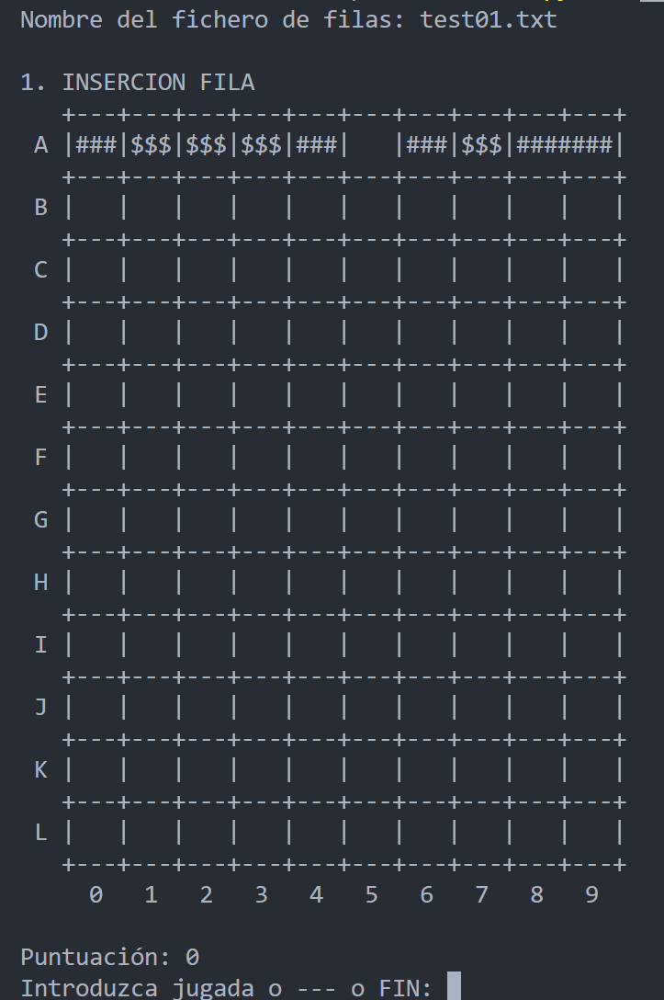

En este momento se nos solicita realizar una jugada (movimiento de una de las piezas), no hacer nada o terminar. Si decidimos no hacer ninguna jugada en este momento, es decir, introducir "---" veremos como no se hace ningún movimiento, caen las piezas, se eliminan en el caso de ser necesario y aparecen las siguientes.

Vemos como se produce desde el principio (de izquierda a derecha):

  
  
  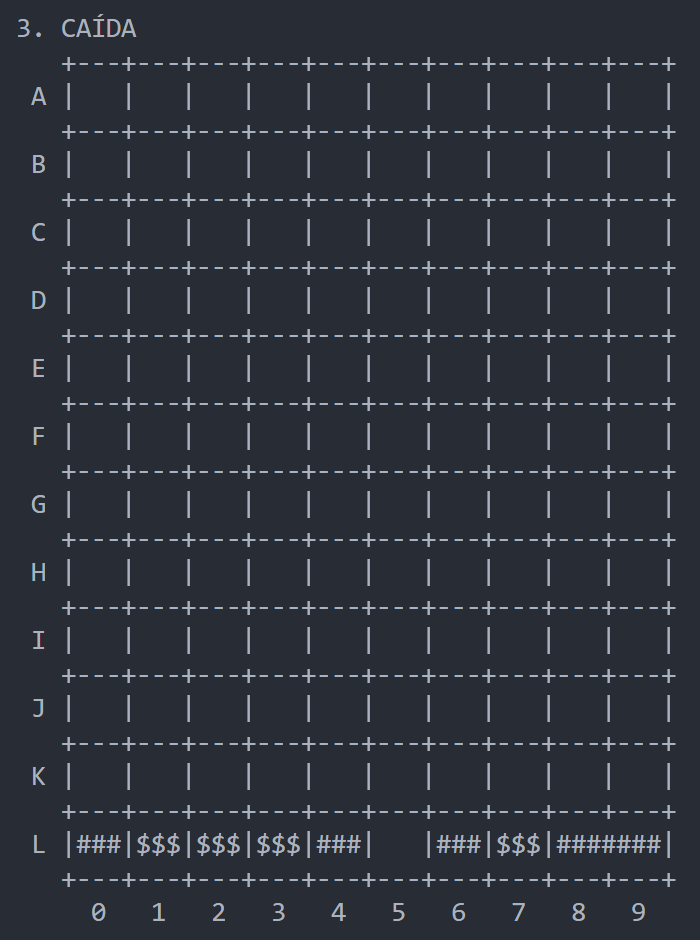
  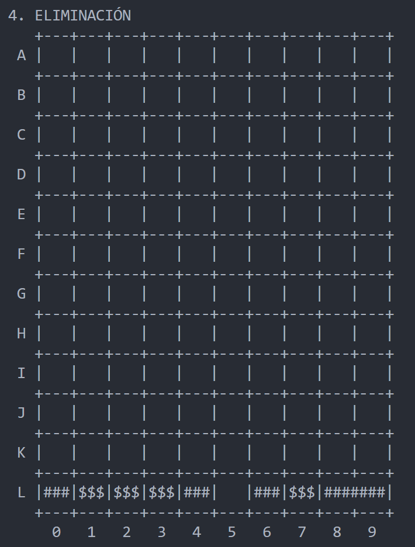
  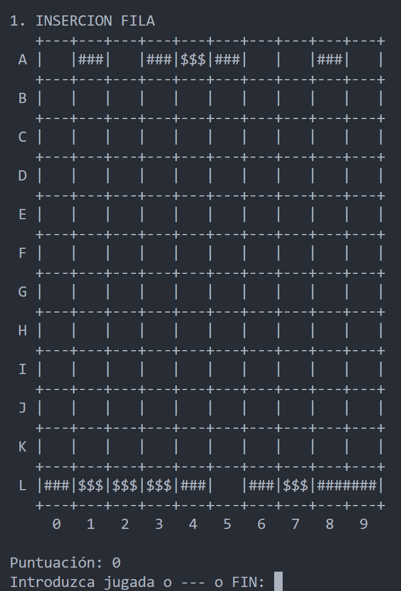

Si ahora realizamos un movimiento para ver que ocurre en ese caso (movemos la pieza que se encuentra en A1 "###" a la izquierda):

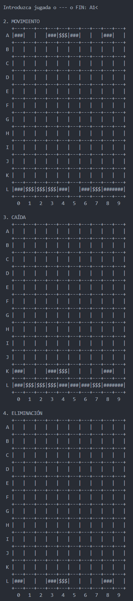
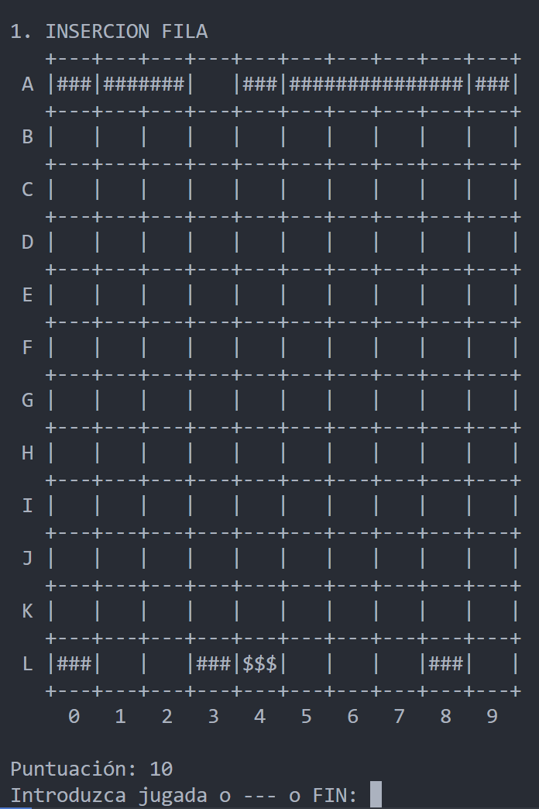

Ahora vemos como nuestra puntuación ha aumentado al haber conseguido eliminar piezas y se nos solicita un nuevo movimiento para que podamos continuar jugando.

## Práctica 2 (Con interfaz)
El funcionamiento del juego es exactamente el mismo que en el caso anterior solo que ahora disponemos de una interfaz en lugar de tener que hacerlo en la consola

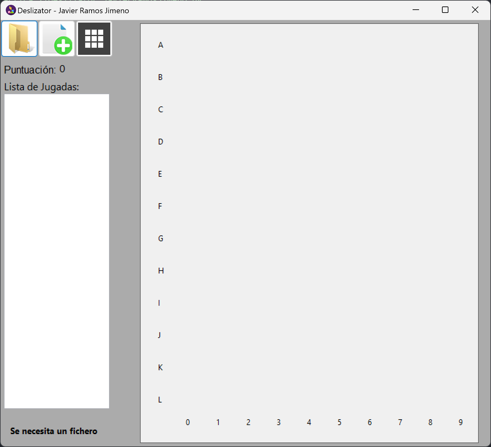

En la interfaz tenemos tres botones que nos permiten:
- El de más a la izquierda nos permite proporcionar el archivo en donde aparecen las piezas que deben ir apareciendo
- El del centro nos permite iniciar una nueva partida
- El de más a la derecha nos permite modificar las dimensiones de nuestro tablero

Para realizar los movimientos simplemente se debe de pulsar en el tablero si queremos no hacer nada o pulsar sobre una pieza y moverla hacia izquierda o derecha para hacer ese movimiento. Una vez indicado el movimiento se produce una animación donde se mueve la pieza, en el caso de ser necesario, caen, se eliminan y aparece la siguiente fila, se añade a la lista de movimientos el movimiento realizado y se actualiza la puntuación (en el caso de que se haya producido alguna eliminación).

Si hacemos la misma secuencia de movimientos que en la práctica 1 (y con el mismo archivo de pruebas):

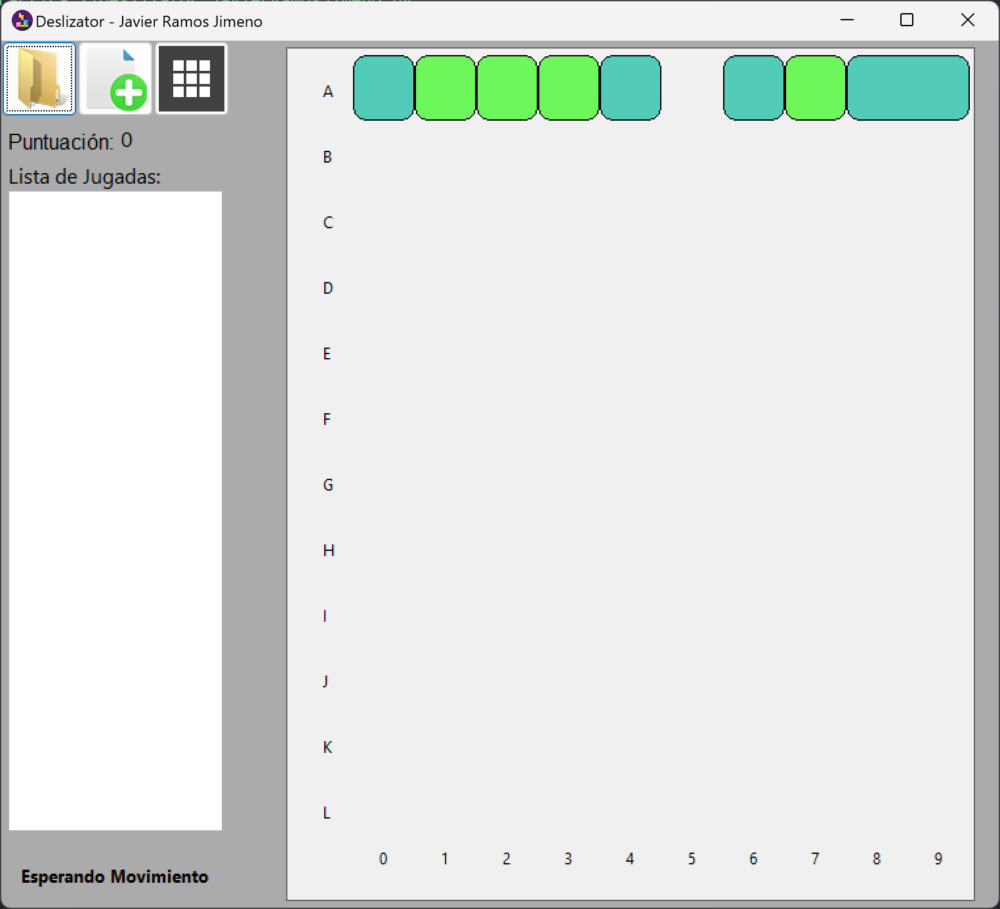
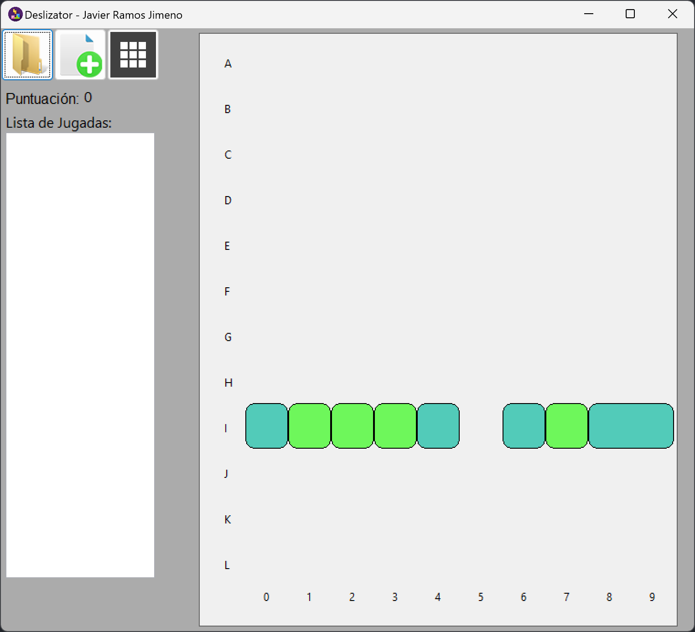
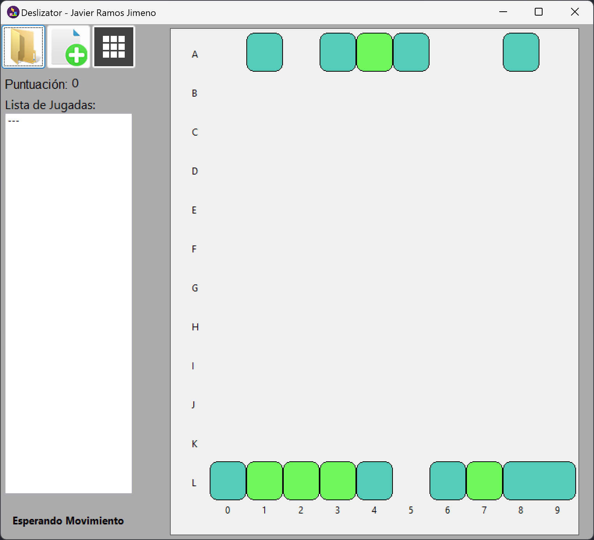
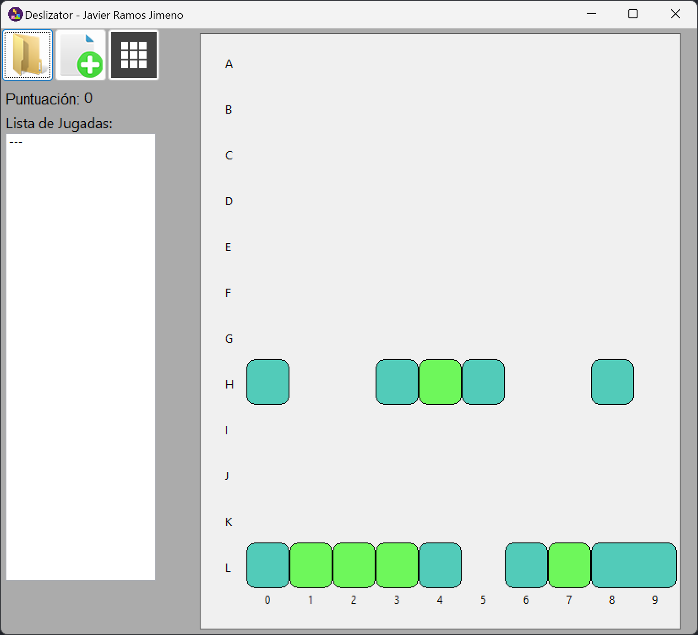
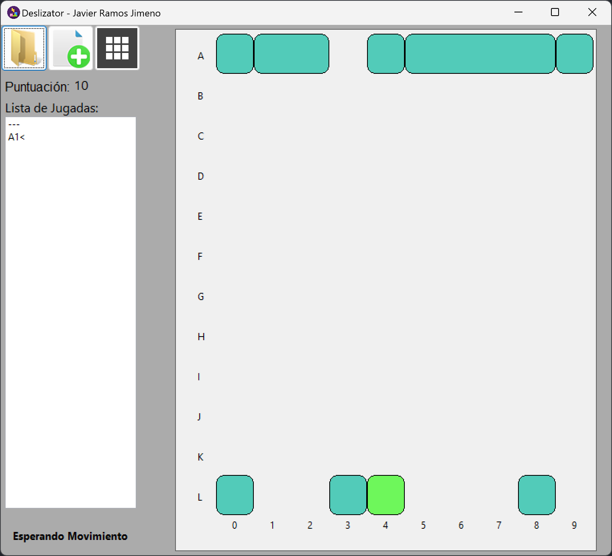
