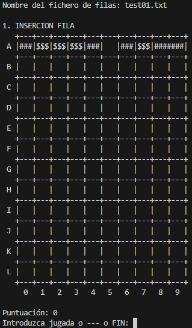
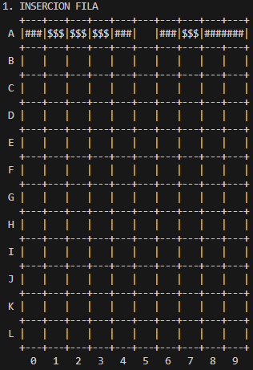
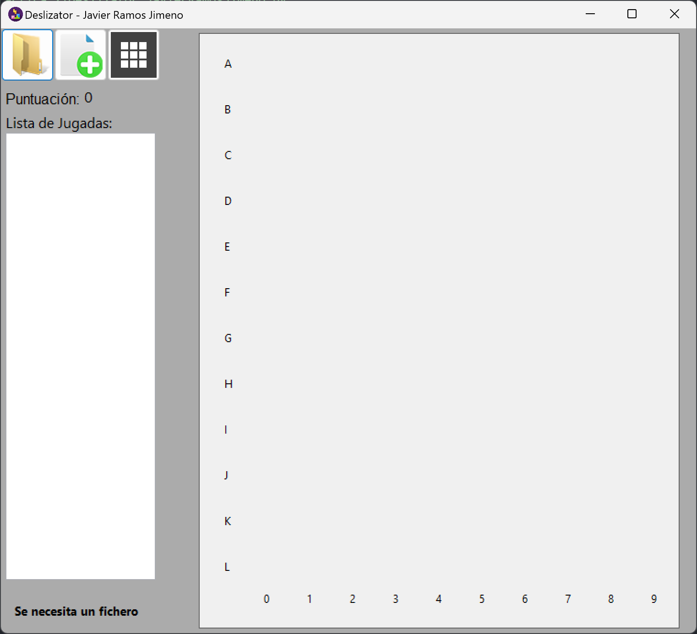

# Deslizator
## Práctica 1 (Sin interfaz)

Al ejecutar el programa lo primero que se necesita es un archivo con la información de las distintas piezas que deben aparecer. 

Una vez proporcionado se muestra por consola la situación del tablero como se puede ver en la siguiente imagen:

En este momento se nos solicita realizar una jugada (movimiento de una de las piezas), no hacer nada o terminar. 

A forma de ejemplo para ver el funcionamiento, suponemos que hacemos la jugada --- seguida de A1<
(Es decir, nuestra primera jugada es dejar caer las piezas tal cual aparecen y la segunda es mover la pieza que se encuentra en A1 ("###") a la izquierda)

Al hacer esto aparecería en consola esta secuencia de tableros:

De forma que podemos ver como tenemos los siguientes pasos:
1. Aparecen nuevas piezas (en función del fichero proporcionado)
2. Se solicita un movimiento para introducir por teclado
3. Se realiza el movimiento indicado
4. Caen las piezas
5. Se eliminan piezas (siempre que sea necesario)

## Práctica 2 (Con interfaz)
El funcionamiento del juego es exactamente el mismo que en el caso anterior solo que ahora disponemos de una interfaz en lugar de tener que hacerlo en la consola

En la interfaz tenemos tres botones que nos permiten:
- El de más a la izquierda nos permite proporcionar el archivo en donde aparecen las piezas que deben ir apareciendo
- El del centro nos permite iniciar una nueva partida
- El de más a la derecha nos permite modificar las dimensiones de nuestro tablero

Para realizar los movimientos simplemente se debe de pulsar en el tablero si queremos no hacer nada o pulsar sobre una pieza y moverla hacia izquierda o derecha para hacer ese movimiento. Una vez indicado el movimiento se produce una animación donde se mueve la pieza, en el caso de ser necesario, caen, se eliminan y aparece la siguiente fila, se añade a la lista de movimientos el movimiento realizado y se actualiza la puntuación (en el caso de que se haya producido alguna eliminación).

En esta versión, además, es posible hacer clic en la lista de jugadas para regresar a ese momento específico del juego.

Si hacemos la misma secuencia de movimientos que en la práctica 1 el resultado es el siguiente (y con el mismo archivo de pruebas):

(Aunque no se puede apreciar en este GIF, el programa incluye una animación que muestra los movimientos de las piezas)

